# Non-Profit-Template


### Template Design

```
Next.js Frontend (Vercel):


App Router for better organization
Server Components for better performance
Client Components where needed
Edge Functions for global distribution


Supabase Backend:


Authentication system built-in
PostgreSQL database with RLS (Row Level Security)
Storage for documents/files
Future RAG capability using pgvector extension


Key Features to Implement:


Membership management
Payment processing (Stripe integration)
Event management
Document storage
Admin dashboard
Member portal


Future RAG Integration:


Supabase supports pgvector
Can store embeddings directly in PostgreSQL
Easy integration with OpenAI/other embedding models
Scale vertically within same infrastructure
```




```mermaid
%%{init: {'theme': 'dark'}}%%
graph TD

subgraph Client["Frontend Layer"]
style Client fill:#000000,stroke:#ffffff
A[Next.js Frontend] --> B[Server Components]
B --> C[Client Components]
end

subgraph Vercel["Edge/API Layer"]
style Vercel fill:#000000,stroke:#ffffff
D[Edge Functions] --> E[API Routes]
E --> F[Middleware]
end

subgraph Data["Database & Auth Layer"]
style Data fill:#000000,stroke:#ffffff
G[Auth] --> H[PostgreSQL]
H --> I[Row Level Security]
J[Storage] --> H
K[Edge Functions] --> H
L[Vector Store] -.Future RAG.-> H
end

A --> D
D --> G
E --> H
F --> G

classDef default fill:#000000,stroke:#ffffff,color:#ffffff
```

### site map

```
├── README.md
├── app
│   ├── api
│   │   ├── events
│   │   ├── members
│   │   └── payments
│   ├── auth
│   │   ├── login
│   │   └── register
│   ├── dashboard
│   │   ├── admin
│   │   └── member
│   └── public
├── components
│   ├── forms
│   ├── shared
│   └── ui
├── lib
│   ├── supabase
│   ├── types
│   └── utils
├── middleware
└── public
```


